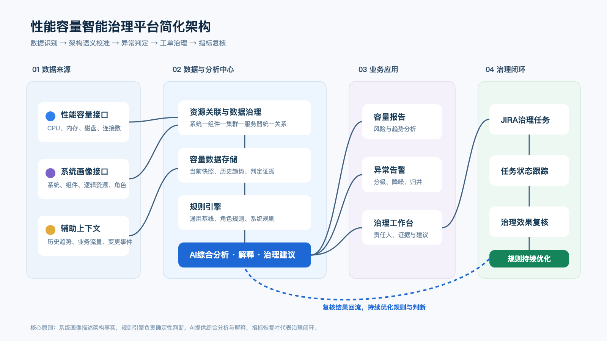

# 性能容量智能治理平台项目汇报

> 汇报目标：基于系统画像、性能容量数据和智能规则，建设覆盖“容量分析—异常识别—告警处置—治理跟踪—效果复核”的性能容量治理闭环。

## 1. 项目背景

现有性能容量接口能够提供系统下各组件、集群及服务器的资源数据，并根据通用基线标记低使用率或高使用率。但是，基线偏离不等同于真实异常。例如，主备架构中的冷备集群长期低使用率通常符合架构预期。

系统画像接口可以补充系统、组件、逻辑资源、部署角色及资源关系。项目将性能数据与系统画像结合，再通过规则引擎和 AI 综合分析，识别真正需要治理的容量问题。

项目的核心目标不是单纯生成容量报表，而是建立完整闭环：

```text
数据采集 → 架构语义补全 → 异常判定 → 报告与告警
        → 治理任务 → 状态跟踪 → 指标复核 → 规则优化
```

## 2. 建设目标

1. **容量可观测**：汇总系统、组件、集群和服务器的性能容量数据。
2. **上下文诊断**：结合系统画像、部署角色、动态规则和历史趋势识别有效异常。
3. **报告与告警**：生成可解释的容量报告、风险清单及分级告警。
4. **治理闭环**：创建并跟踪治理任务，处理完成后自动复核指标。
5. **知识沉淀**：根据人工确认和治理结果持续优化规则与分析知识。

## 3. 简化架构



架构中的职责边界如下：

- **系统画像**回答“资源是谁、属于哪里、承担什么角色”。
- **容量接口**回答“当前及历史性能容量指标是什么”。
- **规则引擎**回答“该指标在当前资源角色下是否符合预期”。
- **AI 分析**负责复杂信息综合、原因解释、规则推荐和治理建议。
- **JIRA**承载治理动作，但任务完成后必须通过指标复核确认治理效果。

### 3.1 建议的判定状态

接口返回的 `code` 仅代表相对于通用基线的使用率状态，建议在平台中拆分为两层：

- `baselineStatus`：原始基线状态，如基线内、低使用率、高使用率。
- `assessmentStatus`：结合画像、规则和趋势得出的最终结论。

最终结论建议包含：

| 状态 | 含义 |
|---|---|
| `NORMAL` | 指标与架构预期一致 |
| `EXPECTED_DEVIATION` | 偏离通用基线，但符合主备、灾备等架构预期 |
| `ANOMALY` | 偏离角色或业务预期，具备明确异常证据 |
| `NEEDS_REVIEW` | 画像缺失、规则冲突或证据不足，需要人工确认 |

## 4. 关键里程碑

以下以约 12～16 周建设周期作为汇报参考，实际时间取决于接口质量、历史数据完整度及团队投入。

| 里程碑 | 建议周期 | 核心交付 | 验收标准 |
|---|---:|---|---|
| M1 数据与资源打通 | 第 1～3 周 | 接入容量接口、系统画像接口，建立资源关联 | 逻辑资源匹配率不低于 95%，数据可追溯 |
| M2 容量报告 MVP | 第 4～6 周 | 系统、组件、集群、服务器多层报告及历史趋势 | 可稳定生成指定系统的容量报告 |
| M3 异常判定能力 | 第 7～9 周 | 规则库、角色规则、异常分级和判定证据 | 主备、双活、灾备等典型场景可正确区分 |
| M4 告警与治理闭环 | 第 10～12 周 | 异常归并、责任人匹配、JIRA 建单和状态同步 | 异常能够形成任务并跟踪至指标复核 |
| M5 AI 增强与试运营 | 第 13～16 周 | AI 解释、治理建议、规则推荐和运营看板 | 输出可解释，人工审核准确率达到阶段目标 |
| M6 规模化运营 | 持续 | 扩大系统覆盖、优化规则、自动化高置信度场景 | 误报率、治理周期和重复异常持续下降 |

### 4.1 分阶段自动化策略

第一阶段：

```text
生成报告 → 识别异常 → 人工确认
```

第二阶段：

```text
人工确认 → 自动创建 JIRA → 自动跟踪
```

第三阶段：

```text
高置信度异常自动建单 → 自动复核 → 自动关闭或重新打开
```

第一版不建议由 AI 无审核地创建大量治理任务，应先通过试运营验证异常准确率、归并能力和责任人映射。

## 5. 主要难点与瓶颈

| 优先级 | 难点 | 可能影响 | 建议应对 |
|---|---|---|---|
| P0 | 系统画像不完整或更新滞后 | 主备角色判断错误，产生误报 | 校验画像更新时间和完整度，设置“画像缺失”状态 |
| P0 | 两类接口缺少稳定关联键 | 服务器无法正确归属逻辑资源 | 优先使用统一资源 ID 或 CMDB ID |
| P0 | 单次快照缺少趋势依据 | 瞬时抖动被错误判断为异常 | 使用持续时间、连续次数和历史同期判断 |
| P1 | 不同系统容量标准不同 | 通用阈值无法适用于所有系统 | 建立通用、组件、角色、系统四级规则 |
| P1 | 规则冲突和版本管理 | 同一数据产生相反结论 | 定义优先级、生效时间、审批及回滚机制 |
| P1 | 告警重复和任务爆炸 | 同一根因产生大量 JIRA 任务 | 按系统、组件、时间窗口和根因进行归并 |
| P1 | JIRA 完成不等于治理完成 | 工单关闭后指标仍然异常 | 设置观察窗口，完成后自动复核指标 |
| P2 | AI 判断不可重复或难解释 | SRE 不信任分析结论 | AI 作为增强能力，保留规则和指标证据 |
| P2 | 责任团队映射不准确 | 工单派错人或长期无人处理 | 从系统画像或服务目录维护责任关系 |

项目早期的主要瓶颈通常不是大模型能力，而是：

> 画像准确度、资源关联质量、历史数据完整度和异常规则共识。

## 6. 运营方式

### 6.1 数据质量指标

- 系统画像覆盖率；
- 逻辑资源与服务器匹配率；
- 性能数据完整率；
- 数据采集和处理延迟；
- 无法归属的服务器数量；
- 画像超过规定时间未更新的系统数量。

### 6.2 异常识别质量指标

- 原始基线偏离数量；
- 符合架构预期的偏离数量；
- 确认异常数量；
- 待人工确认数量；
- 误报率和漏报率；
- AI 建议采纳率；
- 各规则命中次数和有效率。

### 6.3 治理效率指标

- 新增治理任务数；
- 已接收、处理中、已完成和已逾期任务数；
- 平均响应时间；
- 平均治理周期；
- JIRA 完成后的指标恢复率；
- 重复异常率；
- 超期任务比例。

### 6.4 容量治理成效指标

- 高使用率风险资源下降数量；
- 长期闲置资源治理数量；
- 回收的 CPU、内存及服务器规模；
- 避免扩容或提前扩容的资源数量；
- 重复风险下降比例；
- 重点系统容量健康趋势。

### 6.5 建议跟踪频率

| 频率 | 主要动作 | 主要参与人 |
|---|---|---|
| 5～15 分钟 | 采集指标、执行高风险规则、触发紧急告警 | 平台自动执行、值班 SRE |
| 每小时 | 重新计算持续性异常，合并重复事件 | 平台自动执行 |
| 每日 | 检查新增异常、未确认项、JIRA 状态和数据质量 | SRE、系统负责人 |
| 每周 | 容量治理例会，检查逾期任务和误报 | SRE、应用团队、平台团队 |
| 每月 | 发布容量报告，统计治理成果、资源变化和重点风险 | 技术管理者、容量负责人 |
| 每季度 | 复盘规则有效性，调整阈值，检查画像和责任关系 | 架构、SRE、应用团队 |

跟踪频率可以根据系统等级差异化：

- 核心系统：分钟级检测、每日跟踪；
- 重要系统：小时级检测、每周跟踪；
- 一般系统：日级检测、月度汇总。

## 7. 治理闭环

```text
发现基线偏离
→ 系统画像补充架构上下文
→ 规则与 AI 确认真实异常
→ 告警并创建治理任务
→ 跟踪责任人与完成时限
→ 重新采集和复核指标
→ 确认风险消除
→ 优化规则与知识
```

治理任务不应以“JIRA 已完成”为最终结束条件。只有相关指标在约定观察窗口内恢复正常，或者确认符合新的容量预期，才能判定治理闭环完成。如果 JIRA 已完成但指标仍然异常，应自动重新打开任务或进入人工复核状态。

## 8. 项目价值

项目最终价值不只是“发现多少异常”，而是：

- 降低通用基线造成的误报；
- 提前识别真实容量风险；
- 缩短异常响应和治理周期；
- 减少重复发生的容量问题；
- 沉淀可复用、可解释的容量治理规则；
- 量化资源优化、成本节省和风险下降成果。

建议项目阶段性评价同时关注三个结果：**判断是否更准、治理是否更快、风险是否真正消除**。
